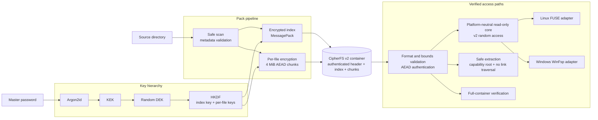

# CipherFS

**[產品網站](https://tw-rf54732.github.io/CipherFS/)** · **[下載 Windows 版](https://tw-rf54732.github.io/CipherFS/download/)**

CipherFS is an experimental side project that explores a read-only encrypted
virtual filesystem for Linux and Windows. It is a hobby project and a playground for trying
out filesystem and encryption-related ideas - not a production security product.

**Rust 2024** · **Linux / FUSE 3** · **Windows / WinFsp** · **Argon2id** ·
**ChaCha20-Poly1305** · **HKDF** · **Authenticated Random Access** ·
**Versioned Binary Format** · **Capability-style Safe I/O** · **GitHub Actions**

## Architecture at a Glance



| Engineering area | What this project demonstrates |
| --- | --- |
| Systems programming | Shared read-only core, Linux FUSE and Windows WinFsp adapters, range reads, bounded chunk cache |
| Applied cryptography | Password KDF, key hierarchy, domain-separated keys, AEAD-bound metadata and chunks |
| Storage design | Versioned v2 container format, encrypted index, authenticated random-access chunk layout |
| Defensive I/O | Overflow/resource limits, atomic pack/replace, source-change detection, whole-tree atomic extraction |
| Verification and delivery | Tamper/replay/truncation tests, Linux FUSE and Windows WinFsp E2E jobs, signed self-update releases |

> [!WARNING]
> CipherFS has not received a professional security audit or extensive
> real-world testing. Although it uses established cryptographic primitives and
> common key-management patterns, their use in this project may contain design
> or implementation mistakes. Do not rely on CipherFS as the sole protection
> for sensitive, valuable, or irreplaceable data. Keep independent backups and
> evaluate the code and risks for your own use case.

## Project Status

- Experimental and developed as a side project.
- v3.1.0 is the first stable release with the workspace-separated core,
  platform adapters, CLI, updater, and optional Windows Shell frontend. The
  project status remains experimental rather than security-audited.
- Testing covers v2 pack, verify, atomic extract, FUSE and WinFsp read-only
  mounts, corruption failure, and signed release metadata. This does not
  establish security, data-recovery, or performance guarantees.
- Bug reports and contributions are welcome, but maintenance and support are
  provided on a best-effort basis.

## Quick Start: Install and Use

Release binaries are provided for convenience and remain subject to the same
experimental status and limitations described above.

<details open>
<summary><strong>Windows: recommended Shell and Explorer workflow</strong></summary>

1. Download `CipherFS-Setup-x64.exe` from
   [GitHub Releases](https://github.com/TW-RF54732/CipherFS/releases).
2. Run Setup. It installs CipherFS machine-wide in `Program Files`, adds the
   CLI to the system `PATH`, and registers Explorer integration. The offline
   Setup contains the pinned official WinFsp 2.1 MSI and installs it only when
   no compatible or newer WinFsp is present. Windows therefore requests
   administrator approval. CipherFS is currently unsigned, so Windows may show
   **Unknown publisher**.
3. In Explorer, right-click a folder and select **Pack with CipherFS**. On
   Windows 11, find this command under **Show more options**. To open an
   existing container, double-click its `.cfs` file and choose **Mount**,
   **Extract**, **Verify**, or **Change password**.

Mount opens the container as an automatic read-only WinFsp drive. It remains
mounted while the Shell window is open; choose **Unmount** before closing it.
Pack, Extract, Verify, and Change Password work without WinFsp, but Verify
still asks for a password because it authenticates the complete container.

Run the same Setup again to repair or update CipherFS. Remove CipherFS through
Windows **Installed apps**; WinFsp is retained because other applications may
use that shared system component. Setup does not change Windows `UserChoice`
defaults.
</details>

<details>
<summary><strong>Linux or Windows: CLI workflow</strong></summary>

On Linux, install FUSE 3 and its development package with your distribution's
package manager before using `mount`. Download `cipherfs-linux-x64.tar.gz`
from [GitHub Releases](https://github.com/TW-RF54732/CipherFS/releases), extract
it, and make the binary executable:

```bash
chmod +x cipherfs
```

On Windows, Setup makes `cipherfs.exe` available in new terminals. The
`cipherfs-windows-portable-x64.zip` alternative is for advanced portable use:
unzip it and run `cipherfs.exe` from that directory. Portable mode never writes
`PATH`, Registry, Explorer integration, or an Installed apps entry. Windows has
an unrelated `cipher.exe` command; use `Get-Command cipherfs.exe` if needed.

Use the same commands on Linux and Windows; replace `./cipherfs` with
`./cipherfs.exe` in PowerShell:

```bash
# Create an encrypted .cfs container (prompts for a password)
./cipherfs pack <source_directory> [output_file] [--threads 0]

# Open it read-only; use an existing empty directory on Linux
./cipherfs mount <container.cfs> <mount_point> [--cache-mib 64]

# Recover files into a destination that does not yet exist
./cipherfs extract <container.cfs> <output_dir> [--threads 0]

# Authenticate the entire container without extracting it
./cipherfs verify <container.cfs> [--threads 0]
```

Press **Ctrl+C** to unmount from the CLI. On Windows, `<mount_point>` may be a
drive such as `X:`, an empty directory, or `auto` to choose the next free drive
letter. Run `cipherfs licenses` to see bundled attribution and the no-warranty
notice.
</details>

## What It Experiments With

### Encryption and Key Management

- Argon2id-based password key derivation.
- ChaCha20-Poly1305 authenticated encryption.
- Separate Data Encryption Key (DEK) and Key Encryption Key (KEK), allowing a
  password to be changed without re-encrypting all file data.
- CipherFS v2 gives every file a random ID and independently derived key.
- Files are encrypted in independent 4 MiB chunks to support authenticated
  random access and isolate corruption to one file.

These choices describe the current implementation; they should not be
interpreted as proof that the overall system is secure.

### Read-only Filesystem Access

- Packs a directory into an encrypted container.
- Mounts a container read-only through FUSE on Linux or WinFsp on Windows.
- Extracts files from a container without mounting it.
- Includes signed in-place self-update for the Linux portable binary. On
  Windows, the compatible `update` command only directs users to Setup.

### Experimental Duress Password

CipherFS v2 protects an optional secondary password with its own Argon2id
derivation and authenticated keyslot. Entering it overwrites both wrapped DEK
slots stored in the container header.

This feature is especially sensitive to implementation details and storage
behavior. It has not been independently verified and must not be treated as a
guaranteed secure-erasure or anti-forensics mechanism. Copies, backups,
snapshots, SSD remapping, and previously recovered keys can defeat it.

## Container Compatibility

- New containers are always written in the CipherFS v2 format.
- CipherFS v3.1.0 supports only v2 containers. Every command rejects v1 before
  prompting for a password or allocating container-controlled resources.
- Existing v2 containers remain compatible; the v2 on-disk format is unchanged.
- Dropping the v1 reader is an intentional breaking compatibility change, so
  this release uses a new major version even though the v2 container format is
  unchanged.

### Legacy v1 Migration

There is no v1 reader in the stable binary. To migrate a trusted v1 container,
use the archived `v2.2.0-beta.1` (or an earlier compatible release) to extract
it, then pack that directory with v3.1.0. Never use the legacy reader for an
untrusted container.

## Build from Source

```bash
cargo build --locked --release
```

This builds the platform CLI from `cipherfs-cli`. On Windows, build the native
Explorer frontend explicitly with:

```powershell
cargo build --locked --release -p cipherfs-windows-shell
```

See [ARCHITECTURE.md](ARCHITECTURE.md) for crate boundaries and the isolated
Windows operation-worker protocol. The repository pins the Rust toolchain.
Linux release artifacts target `x86_64-unknown-linux-musl`; Windows artifacts
target `x86_64-pc-windows-msvc`.

## Performance Notes

- Pack, extract, and verify parallelize v2 chunk cryptography on the CPU.
- Performance comparisons must use a release build (`cargo build --release` or
  `cargo run --release`). The default `cargo run` development build is not a
  meaningful encryption-throughput benchmark.
- Pack writes encrypted chunks directly to their authenticated index offsets;
  the v2 on-disk format remains compatible with existing v2 containers.
- Parallelism is bounded by the worker count, so processing a 100 GB file does
  not require holding the whole file in memory.
- More threads only help until storage bandwidth becomes the bottleneck. On a
  slower disk, a lower `--threads` value may provide similar throughput with
  less CPU and memory pressure.
- WSL access to Windows-mounted paths such as `/mnt/c` crosses a filesystem
  boundary and may behave very differently from native WSL ext4 storage. Test
  `--threads 1`, `4`, and `0` on representative data before choosing a default
  for large jobs.
- GPU encryption is not currently used. ChaCha20-Poly1305 is CPU-friendly, and
  transferring 4 MiB chunks through GPU memory adds portability, driver, and
  plaintext-exposure costs that need measured benefits before adoption.

### Updates

```bash
./cipherfs update
```

On Linux, official release builds contain a Minisign public key. The updater
refuses to replace itself unless the manifest signature, version, target, file
size, and SHA-256 digest all match. Source builds without an embedded trusted
key intentionally disable automatic replacement.

On Windows, `cipherfs update` does not modify files. Download and run the newest
`CipherFS-Setup-x64.exe`; Setup performs repair or a major upgrade. Portable ZIP
users replace their extracted files manually.

## Platform Support

- Linux x86-64 with FUSE 3
- Windows x86-64 with the machine-wide WinFsp 2.1 runtime

The recommended Windows release is the machine-wide offline Setup; a portable
ZIP is also provided. Neither currently has an Authenticode certificate, so
SmartScreen may identify an unknown publisher. Release manifests remain
Minisign-signed and SHA-256 hashes and Artifact Attestations are published as
advanced verification material. Do not run Setup while CipherFS operations or
mounts are active; Setup reports files in use instead of forcibly terminating
them.

CipherFS stores file contents, names and directory structure. It does not
preserve platform ACLs, ownership, timestamps, xattrs, alternate data streams,
hard-link identity, sparse allocation or filesystem-specific metadata.

## Testing

Before a release, both platforms run formatting, Clippy with warnings denied,
unit tests and release builds. Linux additionally runs real FUSE pack/read/
corruption/unmount E2E. Windows first proves non-mount commands start without
WinFsp, then installs the pinned official runtime and runs folder, drive and
`auto` WinFsp E2E. Dependency advisories, license policy, CodeQL and signed
artifact verification are release gates. See [RELEASING.md](RELEASING.md) for
the local and CI checklist.

## Security Boundaries

CipherFS is intended to keep an offline container private from casual access
when the password is not known. It does not prevent copying or replaying an
entire valid container, protect plaintext while mounted, resist a compromised
operating system, or guarantee recovery from damaged media.

See [SECURITY.md](SECURITY.md) for the threat model and reporting guidance, and
[FORMAT_V2.md](FORMAT_V2.md) for the v2 format and validation rules.

## License and Disclaimer

CipherFS-authored source is available under the [MIT License](LICENSE). The
Windows executable incorporates the GPLv3 `winfsp-rs` binding and is distributed
subject to GPLv3 for the combined binary. The full text is in
[LICENSE-GPL-3.0](LICENSE-GPL-3.0). Run `cipherfs licenses` or see
[THIRD_PARTY_NOTICES.md](THIRD_PARTY_NOTICES.md) for the complete distinction
and WinFsp attribution. The locked dependency list and exact-version source
URLs are in [THIRD_PARTY_DEPENDENCIES.md](THIRD_PARTY_DEPENDENCIES.md).

This README is a practical project warning, not legal or security advice.
