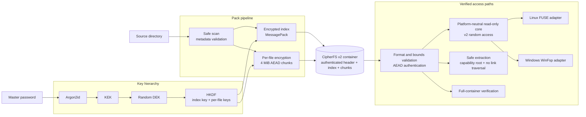

# CipherFS

CipherFS is an experimental side project that explores a read-only encrypted
virtual filesystem for Linux and Windows. It is a hobby project and a playground for trying
out filesystem and encryption-related ideas - not a production security product.

**Rust 2024** · **Linux / FUSE 3** · **Windows / WinFsp** · **Argon2id** ·
**ChaCha20-Poly1305** · **HKDF** · **Authenticated Random Access** ·
**Versioned Binary Format** · **Capability-style Safe I/O** · **GitHub Actions**

## Architecture at a Glance



| Engineering area | What this project demonstrates |
| --- | --- |
| Systems programming | Shared read-only core, Linux FUSE and Windows WinFsp adapters, range reads, bounded chunk cache |
| Applied cryptography | Password KDF, key hierarchy, domain-separated keys, AEAD-bound metadata and chunks |
| Storage design | Versioned v2 container format, encrypted index, authenticated random-access chunk layout |
| Defensive I/O | Overflow/resource limits, atomic pack/replace, source-change detection, whole-tree atomic extraction |
| Verification and delivery | Tamper/replay/truncation tests, Linux FUSE and Windows WinFsp E2E jobs, signed self-update releases |

> [!WARNING]
> CipherFS has not received a professional security audit or extensive
> real-world testing. Although it uses established cryptographic primitives and
> common key-management patterns, their use in this project may contain design
> or implementation mistakes. Do not rely on CipherFS as the sole protection
> for sensitive, valuable, or irreplaceable data. Keep independent backups and
> evaluate the code and risks for your own use case.

## Project Status

- Experimental and developed as a side project.
- v3.1.0 is the first stable release with the workspace-separated core,
  platform adapters, CLI, updater, and optional Windows Shell frontend. The
  project status remains experimental rather than security-audited.
- Testing covers v2 pack, verify, atomic extract, FUSE and WinFsp read-only
  mounts, corruption failure, and signed release metadata. This does not
  establish security, data-recovery, or performance guarantees.
- Bug reports and contributions are welcome, but maintenance and support are
  provided on a best-effort basis.

## What It Experiments With

### Encryption and Key Management

- Argon2id-based password key derivation.
- ChaCha20-Poly1305 authenticated encryption.
- Separate Data Encryption Key (DEK) and Key Encryption Key (KEK), allowing a
  password to be changed without re-encrypting all file data.
- CipherFS v2 gives every file a random ID and independently derived key.
- Files are encrypted in independent 4 MiB chunks to support authenticated
  random access and isolate corruption to one file.

These choices describe the current implementation; they should not be
interpreted as proof that the overall system is secure.

### Read-only Filesystem Access

- Packs a directory into an encrypted container.
- Mounts a container read-only through FUSE on Linux or WinFsp on Windows.
- Extracts files from a container without mounting it.
- Includes a self-update command for GitHub releases.

### Experimental Duress Password

CipherFS v2 protects an optional secondary password with its own Argon2id
derivation and authenticated keyslot. Entering it overwrites both wrapped DEK
slots stored in the container header.

This feature is especially sensitive to implementation details and storage
behavior. It has not been independently verified and must not be treated as a
guaranteed secure-erasure or anti-forensics mechanism. Copies, backups,
snapshots, SSD remapping, and previously recovered keys can defeat it.

## Container Compatibility

- New containers are always written in the CipherFS v2 format.
- CipherFS v3.1.0 supports only v2 containers. Every command rejects v1 before
  prompting for a password or allocating container-controlled resources.
- Existing v2 containers remain compatible; the v2 on-disk format is unchanged.
- Dropping the v1 reader is an intentional breaking compatibility change, so
  this release uses a new major version even though the v2 container format is
  unchanged.

### Legacy v1 Migration

There is no v1 reader in the stable binary. To migrate a trusted v1 container,
use the archived `v2.2.0-beta.1` (or an earlier compatible release) to extract
it, then pack that directory with v3.1.0. Never use the legacy reader for an
untrusted container.

## Installation

On Linux, install FUSE 3 and its development package. On Windows, install the
official [WinFsp 2.1 runtime](https://winfsp.dev/rel/). The portable CipherFS
download does not install or rebrand the WinFsp driver. The repository pins
`winfsp-rs` 0.13 and vendors its generated WinFsp 2.1 bindings so a source build
does not require libclang.

### Download a Release

Download a binary from the
[GitHub Releases](https://github.com/TW-RF54732/CipherFS/releases) page, then
make it executable:

```bash
chmod +x cipherfs
```

Release binaries are provided for convenience and remain subject to the same
experimental status and limitations described above.

### Windows Explorer Integration

The Windows ZIP contains the portable `cipherfs.exe` CLI and the optional
`cipherfs-shell.exe` native shell frontend. Run `cipherfs-shell.exe` and choose
**Install Windows integration** to copy both executables to the current user's
`%LOCALAPPDATA%\Programs\CipherFS` directory. No administrator rights, service,
driver installation, or MSIX package is used.

It registers an Open With handler for `.cfs` and a **Pack with CipherFS**
folder verb. Windows 11 shows the folder verb under **Show more options**;
CipherFS deliberately does not install a COM Explorer extension. The installer
does not modify Windows `UserChoice` defaults. Run the shell frontend again to
repair, update, or uninstall this integration.

Double-clicking a `.cfs` file opens a dark, custom Slint interface. CipherFS
prompts, progress, cancellation, mount status and errors use one Slint window;
Windows continues to provide file pickers, Explorer launching and shell verbs.
Mount creates an automatic read-only WinFsp drive and keeps it mounted while
its window is open. Pack, Extract, Verify and Change Password use the same v2
core as the CLI; Verify still requires a password because it authenticates the
full encrypted container.

Passwords entered in the Slint interface are moved into zeroizing operation
secrets and the visible fields are cleared immediately on submission. Slint may
internally create framework-managed string copies, so CipherFS does not claim
that every GUI password-memory copy can be overwritten deterministically.

### Build from Source

```bash
cargo build --locked --release
```

This builds the platform CLI from `cipherfs-cli`. On Windows, build the native
Explorer frontend explicitly with:

```powershell
cargo build --locked --release -p cipherfs-windows-shell
```

See [ARCHITECTURE.md](ARCHITECTURE.md) for crate boundaries and the isolated
Windows operation-worker protocol.

The repository pins the Rust toolchain. Linux release artifacts target
`x86_64-unknown-linux-musl`; Windows artifacts target
`x86_64-pc-windows-msvc`.

## Usage

### Pack a Directory

```bash
./cipherfs pack <source_directory> [output_file] [--threads 0]
```

CipherFS encrypts independent 4 MiB chunks concurrently. `--threads 0` (the
default) uses the available CPU parallelism; set a positive value to limit the
worker count when sharing the machine with other workloads.

### Mount a Container

```bash
./cipherfs mount <container.cfs> <mount_point> [--cache-mib 64]
```

The filesystem is mounted read-only. Press **Ctrl+C** to unmount.

On Windows, `<mount_point>` may be a drive such as `X:`, an empty directory, or
the literal `auto` to select the next free drive letter. Containers with names
that Windows cannot represent are exposed through deterministic `~cfs-<id>`
names and reported as warnings; the encrypted container is not modified.

Run `cipherfs licenses` to view the bundled third-party attribution and
no-warranty notice.

PowerShell users must run `cipherfs.exe`. Windows includes an unrelated command
named `cipher.exe`; it is not CipherFS. Use `Get-Command cipherfs.exe` when
checking which executable is on `PATH`.

### Extract a Container

```bash
./cipherfs extract <container.cfs> <output_dir> [--threads 0]
```

`<output_dir>` must not exist. Extraction builds a private sibling staging tree,
authenticates and flushes every file, then installs the complete directory with
one no-replace atomic rename. Corruption or any pre-commit I/O/name failure
removes staging and leaves no output directory. Ancestor symlinks, junctions,
and Windows reparse points are rejected.

### Verify Without Extracting

```bash
./cipherfs verify <container.cfs> [--threads 0]
```

This authenticates the v2 header, index, and every encrypted data chunk. Data
chunks are verified concurrently.

### Performance Notes

- Pack, extract, and verify parallelize v2 chunk cryptography on the CPU.
- Performance comparisons must use a release build (`cargo build --release` or
  `cargo run --release`). The default `cargo run` development build is not a
  meaningful encryption-throughput benchmark.
- Pack writes encrypted chunks directly to their authenticated index offsets;
  the v2 on-disk format remains compatible with existing v2 containers.
- Parallelism is bounded by the worker count, so processing a 100 GB file does
  not require holding the whole file in memory.
- More threads only help until storage bandwidth becomes the bottleneck. On a
  slower disk, a lower `--threads` value may provide similar throughput with
  less CPU and memory pressure.
- WSL access to Windows-mounted paths such as `/mnt/c` crosses a filesystem
  boundary and may behave very differently from native WSL ext4 storage. Test
  `--threads 1`, `4`, and `0` on representative data before choosing a default
  for large jobs.
- GPU encryption is not currently used. ChaCha20-Poly1305 is CPU-friendly, and
  transferring 4 MiB chunks through GPU memory adds portability, driver, and
  plaintext-exposure costs that need measured benefits before adoption.

### Install a Signed Update

```bash
./cipherfs update
```

Official release builds contain a Minisign public key. The updater refuses to
replace itself unless the release manifest signature, version, target, file
size, and SHA-256 digest all match. Source builds without an embedded trusted
key intentionally disable automatic replacement.

## Platform Support

- Linux x86-64 with FUSE 3
- Windows x86-64 with the separately installed WinFsp 2.1 runtime

Windows releases are portable and may trigger SmartScreen because CipherFS does
not currently have an Authenticode certificate. Release manifests remain
Minisign-signed and include SHA-256 hashes.

Managed Windows integration updates are opt-in. They download and verify a
separate Minisign-signed manifest containing the names, sizes and SHA-256
digests of both Windows executables. The portable CLI continues to use its
original single-binary update manifest. The current managed installer/updater
is isolated in the Windows shell crate, but cross-process locking and fully
transactional replacement/rollback remain deferred work; do not update while
CipherFS operations or mounts are active.

CipherFS stores file contents, names and directory structure. It does not
preserve platform ACLs, ownership, timestamps, xattrs, alternate data streams,
hard-link identity, sparse allocation or filesystem-specific metadata.

## Testing

Before a release, both platforms run formatting, Clippy with warnings denied,
unit tests and release builds. Linux additionally runs real FUSE pack/read/
corruption/unmount E2E. Windows first proves non-mount commands start without
WinFsp, then installs the pinned official runtime and runs folder, drive and
`auto` WinFsp E2E. Dependency advisories, license policy, CodeQL and signed
artifact verification are release gates. See [RELEASING.md](RELEASING.md) for
the local and CI checklist.

## Security Boundaries

CipherFS is intended to keep an offline container private from casual access
when the password is not known. It does not prevent copying or replaying an
entire valid container, protect plaintext while mounted, resist a compromised
operating system, or guarantee recovery from damaged media.

See [SECURITY.md](SECURITY.md) for the threat model and reporting guidance, and
[FORMAT_V2.md](FORMAT_V2.md) for the v2 format and validation rules.

## License and Disclaimer

CipherFS-authored source is available under the [MIT License](LICENSE). The
Windows executable incorporates the GPLv3 `winfsp-rs` binding and is distributed
subject to GPLv3 for the combined binary. The full text is in
[LICENSE-GPL-3.0](LICENSE-GPL-3.0). Run `cipherfs licenses` or see
[THIRD_PARTY_NOTICES.md](THIRD_PARTY_NOTICES.md) for the complete distinction
and WinFsp attribution. The locked dependency list and exact-version source
URLs are in [THIRD_PARTY_DEPENDENCIES.md](THIRD_PARTY_DEPENDENCIES.md).

This README is a practical project warning, not legal or security advice.
